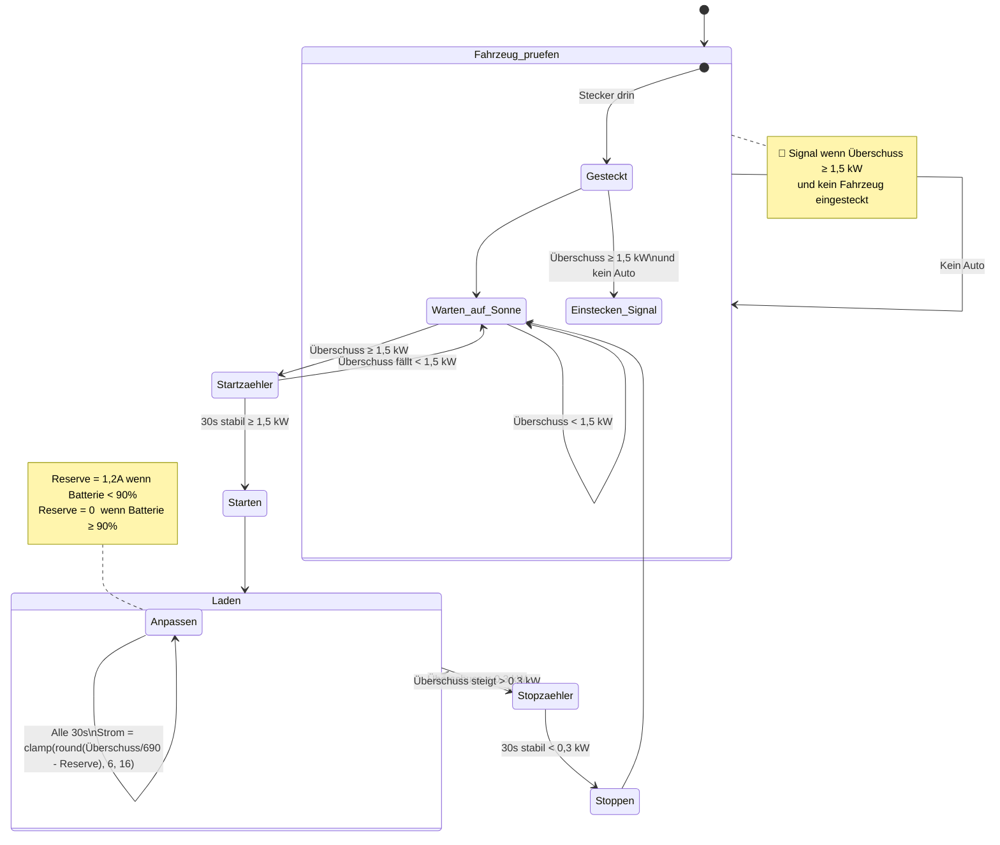

```mermaid
stateDiagram-v2
    [*] --> Fahrzeug_pruefen

    state Fahrzeug_pruefen {
        [*] --> Gesteckt : Stecker drin
        Gesteckt --> Warten_auf_Sonne
        Gesteckt --> Einstecken_Signal : Überschuss ≥ 1,5 kW\nund kein Auto
    }

    Warten_auf_Sonne --> Startzaehler : Überschuss ≥ 1,5 kW
    Warten_auf_Sonne --> Warten_auf_Sonne : Überschuss < 1,5 kW

    Startzaehler --> Starten : 30s stabil ≥ 1,5 kW
    Startzaehler --> Warten_auf_Sonne : Überschuss fällt < 1,5 kW

    state Laden {
        Anpassen --> Anpassen : Alle 30s\nStrom = clamp(round(Überschuss/690 - Reserve), 6, 16)
    }

    Starten --> Laden
    Laden --> Stopzaehler : Überschuss < 0,3 kW

    Stopzaehler --> Stoppen : 30s stabil < 0,3 kW
    Stopzaehler --> Laden : Überschuss steigt > 0,3 kW

    Stoppen --> Warten_auf_Sonne

    Fahrzeug_pruefen --> Fahrzeug_pruefen : Kein Auto

    note right of Fahrzeug_pruefen
        🔌 Signal wenn Überschuss ≥ 1,5 kW
        und kein Fahrzeug eingesteckt
    end note

    note left of Anpassen
        Reserve = 1,2A wenn Batterie < 90%
        Reserve = 0  wenn Batterie ≥ 90%
    end note
```
